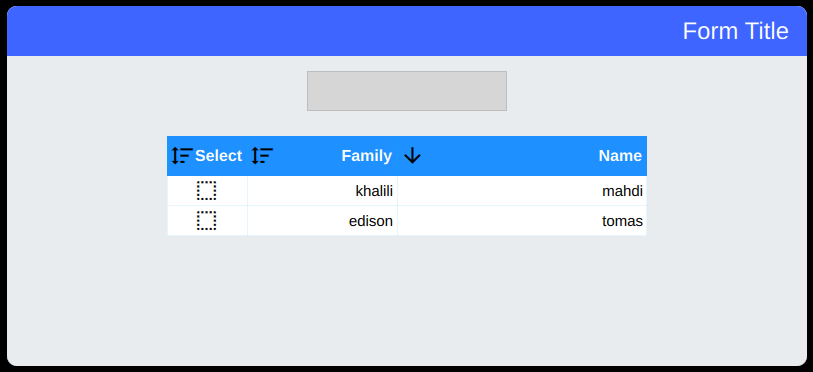

# UTable
This is a right to left table if you need to set it left to right you may need to change some directions there is source and compiled example too its look like this :

You can completly modify cell but not header , it wont be hard to implement header delegate too.
